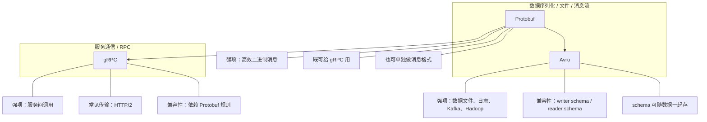
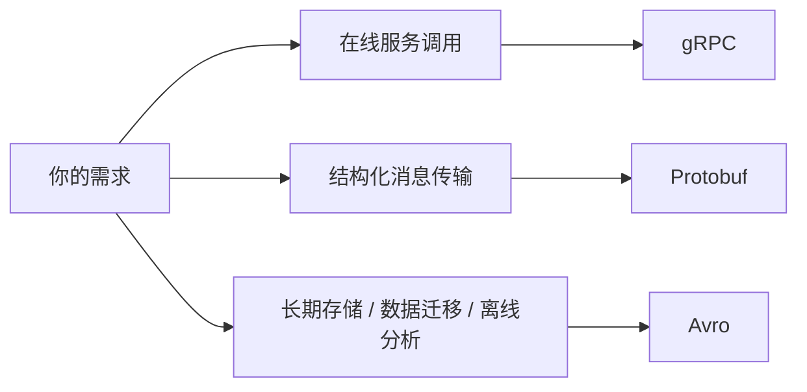

# [如何把大文件上传到 S3](../translations/zh/how-to-upload-a-large-file-to-s3.zh.md)

阅读时间：2026-07-05

## 问题 1：文档里的“大文件分片上传，最后再合并”是当前对象存储的主流做法吗？

**参考答案：** 是的，这属于当前对象存储里非常主流的上传思路。AWS S3 的 multipart upload、Google Cloud Storage 的 resumable upload、Azure Blob Storage 的 block blob/commit 流程，本质上都在做同一类事情：把大对象拆成多个部分，支持并行上传、断点续传和失败重试，最后再提交合并成一个完整对象。  
不过文中有一点需要补充：`ETag` 现在不一定等于 `md5`，尤其在 multipart upload 场景下，AWS 官方说明最终对象的 ETag 不必然是 MD5。另一个细节是，很多 SDK 会自动处理分片和续传，不一定需要业务代码手动切块。

# [用 Avro 实现平滑数据迁移](../translations/zh/smooth-data-migration-with-avro.zh.md)

阅读时间：2026-07-05

## 问题 1：Avro 说它是为了解决 Thrift 在 Hadoop 场景中的局限，这里的“局限”主要指什么？

**参考答案：** 主要指 Thrift 更偏 RPC 和代码生成，不太适合 Hadoop 这种“海量离线数据文件 + schema 演进”的场景。具体来说，Thrift 通常要先定义接口再生成代码，长期存储和跨团队传递数据时，schema 管理成本较高；而 Hadoop 更需要数据文件自描述、老数据和新代码可兼容、schema 可以随数据一起保存的能力。Avro 更贴合这种“数据先写入、以后再读取”的场景。

## 问题 2：Thrift 是不是 gRPC 的前身？

**参考答案：** 不是。Thrift 和 gRPC 更像是同类问题的不同解决方案。Thrift 更早，偏 RPC；gRPC 更晚，基于 HTTP/2 + Protobuf，也偏 RPC。它们都属于服务通信框架，但 gRPC 不是从 Thrift 直接演进出来的。

## 问题 3：Avro、gRPC、Protobuf 三者是什么关系？

**参考答案：** 它们有重叠，但侧重点不同。gRPC 主要是 RPC 通信框架，重点是服务间调用；Protobuf 主要是高效的消息/IDL/序列化格式，常被 gRPC 使用；Avro 更偏数据序列化、文件格式和数据流，重点是 schema 跟数据一起走，以及支持长期存储和 schema 演进。可以把它们理解为：gRPC = 服务调用，Protobuf = 通用消息格式，Avro = 面向数据存储与交换的格式。



## 问题 4：gRPC 不是也支持向下兼容吗？那 Avro 是不是只实现了 gRPC 的一部分功能？

**参考答案：** gRPC 确实支持向下/向上兼容，但它的兼容性主要是建立在 Protobuf 的 schema 演进规则上。Avro 不是 gRPC 的一部分，也不是“实现了 gRPC 的一部分功能”。更准确地说，gRPC 和 Avro 在“schema 演进”和“二进制编码”上有重叠，但它们服务的主场不同：gRPC 面向在线 RPC 调用，Avro 面向离线数据、长期存储、数据迁移和消息流。

## 问题 5：为什么不直接用 Protobuf 替代 Avro？

**参考答案：** 不是不能替代，而是在很多场景下不如 Avro 自然。Protobuf 更偏接口和消息协议，常见于 RPC 和微服务通信；Avro 更偏数据存储和数据流，常见于 Hadoop、Spark、Kafka、数据湖和数据迁移。Avro 的优势在于 writer schema / reader schema 的兼容解析、schema 可随数据一起存、对长期保存的数据更友好；而 Protobuf 通常更适合作为代码先行的消息契约，不一定天然适合把 schema 和大量历史数据长期绑定在一起。

## 问题 6：Avro 具体该怎么使用？

**参考答案：** 可以先记成一句话：先定义 schema，再用这个 schema 去序列化/反序列化数据；如果是文件场景，schema 还能跟数据一起存进 container file 里。常见流程是：
1. 定义 `.avsc` schema。
2. 用 schema 写入 Avro 数据。
3. 读取时根据 writer schema 和 reader schema 做兼容解析。
4. schema 变化时通过默认值、字段兼容规则做演进。

```json
{
  "type": "record",
  "name": "User",
  "namespace": "example.avro",
  "fields": [
    {"name": "name", "type": "string"},
    {"name": "favorite_number", "type": ["null", "int"], "default": null},
    {"name": "favorite_color", "type": ["null", "string"], "default": null}
  ]
}
```

这个例子表示：
- 数据记录叫 `User`
- `name` 是必填字段
- `favorite_number` 和 `favorite_color` 可以为空
- 以后新增字段时，只要设计好默认值和兼容规则，就能更顺滑地读老数据

## 问题 7：Avro 和 gRPC 的“schema 兼容”是不是一回事？

**参考答案：** 不完全是一回事。两者都讲兼容，但关注点不同。gRPC 的兼容更多是“接口调用不崩”和“字段增删改还能通信”；Avro 的兼容更强调“读旧文件、写新文件、老数据和新数据混读”以及“数据和 schema 长期共存”。所以它们在目标上相似，在工程落点上不同。

## 问题 8：什么时候优先选 Avro，什么时候优先选 Protobuf 或 gRPC？

**参考答案：**
- 需要在线服务调用时，优先看 gRPC。
- 需要高效的结构化消息时，Protobuf 很合适。
- 需要长期保存、数据迁移、离线分析、schema 跟数据一起走时，Avro 更合适。


