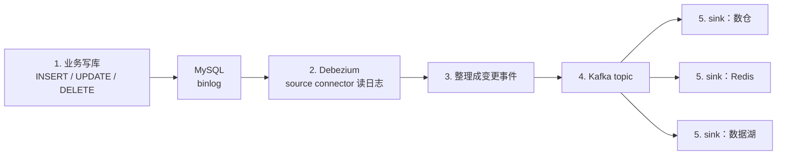
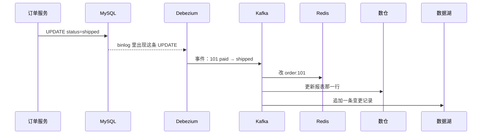
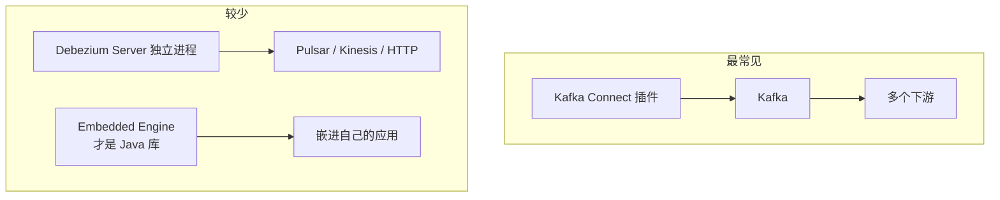

# [纠删码](/Users/rita/study/system-design-101/translations/zh/erasure-coding.zh.md)

阅读时间：2026-08-16

## 问题 1：这里的纠删码是什么？

**参考答案：** 纠删码（Erasure Coding）是对象存储（如 S3）里用来提高数据持久性的冗余方案：不整份复制数据，而是把数据切块、算出校验块，再分散放到不同机器上。任意丢失不超过校验块数量的块，都能用剩下的块把原数据算回来。

文中的 4+2 例子是：数据切成 `d1, d2, d3, d4`，再用线性组合算出校验块 `p1, p2`；即使 `d3, d4` 所在节点挂了，仍可用 `d1, d2, p1, p2` 解方程重建。4 个数据块配 2 个校验块，总存储是原来的 1.5 倍，额外开销 50%；三副本复制的额外开销则是 200%。按文中 Backblaze 测算，节点年故障率 0.81% 时，纠删码约 11 个 9 持久性，三副本约 6 个 9。

生产里常用 Reed-Solomon 这类编码；文中的加减公式只是示意：校验块是数据块的线性组合，丢了几块就解几元方程。代价是编码/解码更吃 CPU 和网络，所以热数据和延迟敏感路径仍常用复制；对象存储、冷数据、备份更常用纠删码。

## 问题 2：4+2 是什么意思？为什么最多能同时丢 2 个块，只要还剩任意 4 个块就能还原？

**参考答案：** 4+2 表示 4 个数据块 + 2 个校验块，一共存 6 块，容错 2。原数据只有 4 个未知数，却存了 6 条互相独立的信息；解 4 个未知数只需要任意 4 条，所以最多能同时少 2 条。丢掉第 3 块就只剩 3 条方程，一般解不出唯一答案。

用小整数示意：`d1=3, d2=5, d3=7, d4=2`，`p1=d1+d2+d3+d4=17`，`p2=1·d1+2·d2+3·d3+4·d4=42`。三种丢法结果一样：

- 丢掉 2 个数据块（如 `d3, d4`）：用 `d1, d2, p1, p2` 解出 `d3=7, d4=2`
- 丢掉 1 个数据块 + 1 个校验块（如 `d1, p1`）：用剩下的 `d2, d3, d4, p2` 解出 `d1=3`
- 丢掉 2 个校验块：4 个数据块还在，不用重建

关键不是“必须保住某几个指定块”，而是 6 选 4 即可。校验块让每一块都变成可互相替代的信息。

## 问题 3：纠删码和 RAID 是什么关系？

**参考答案：** RAID 5 / RAID 6 是纠删码在“一柜子磁盘”上的特例；对象存储纠删码是同一套数学放到多台机器上。纠删码是编码方法（`k` 个数据块 + `m` 个校验块，丢掉不超过 `m` 块还能还原）；RAID 是组盘方式。重叠在校验型 RAID 上：

- RAID 0 只条带、无冗余，不是纠删码
- RAID 1 / 10 是镜像，更接近复制
- RAID 5 是 `N+1`（通常 XOR），最多坏 1 块盘
- RAID 6 是 `N+2`，最多坏 2 块盘，和文中 4+2 同类

RAID 5 的最小例子是 2+1：`d1=3, d2=5, p=d1 XOR d2=6`，任意一块丢了都能用另外两块 XOR 回来。RAID 6 / 4+2 是把 1 个 XOR 校验升级成 2 个更强的校验。

差别在故障域，不在数学：RAID 6 的 6 块盘通常在同一台机器或同一个阵列里，防的是盘坏；对象存储把 6 个块放到不同服务器（最好跨机架/可用区），还防机器坏和机架断电。经典 RAID 盘数有限、重建要读整组盘；分布式纠删码的 `k+m` 可以更大（如 8+3、10+4），用软件编码打散到集群。一句话：RAID 5/6 = 磁盘阵列版纠删码；对象存储纠删码 = 跨机器版 RAID 5/6。

# [变更数据捕获：利用实时数据的关键](/Users/rita/study/system-design-101/translations/zh/change-data-capture-key-to-leverage-real-time-data.zh.md)

阅读时间：2026-08-16

## 问题 1：Debezium 是在做什么？

**参考答案：** Debezium 负责 CDC 流水线里“从数据库把变更抓出来”这一步：它读源库的事务日志，把 INSERT / UPDATE / DELETE 变成一条条变更事件，交给 Kafka，再由下游去更新数仓、缓存等。应用本身不用改代码、也不用自己发消息。

文章把 CDC 拆成 5 步。用户只做第 1 步（改数据），Debezium 主要覆盖第 2 步，并和 Kafka Connect 一起把后面几步串起来：



文中说「Debezium + Kafka Connect，Kafka 当 broker」，就是这条路：源库 → Debezium → Kafka → 下游系统。

**例子：** 订单服务执行：

```sql
INSERT INTO orders (id, user_id, amount, status)
VALUES (101, 7, 99, 'paid');
```

这时业务只写了 MySQL。MySQL 把这次写入记进 binlog。Debezium 的 MySQL connector 读到这条 binlog，往 Kafka 发出类似下面的事件（字段有简化）：

```json
{
  "op": "c",
  "source": { "table": "orders" },
  "after": { "id": 101, "user_id": 7, "amount": 99, "status": "paid" }
}
```

`op: c` 表示 create/insert。若之后改成已发货：

```sql
UPDATE orders SET status = 'shipped' WHERE id = 101;
```

事件会变成 `op: u`（update），并带上 `before.status = paid`、`after.status = shipped`。一个 sink 拿去更新分析库，另一个 sink 拿去刷新 Redis。所以 Debezium 不是数据库，也不是消息队列，而是挂在源库旁边的 CDC 捕获器。

它读日志而不是定时 `SELECT`，因此对源库压力小、能抓住 DELETE、实时性接近事务提交，一般也不用为同步去改表结构。和 Kafka Connect 的分工是：Debezium 提供各种数据库的 source connector，负责从库里抓变更；Kafka Connect 是跑这些 connector 的框架，并对接各类 sink；Kafka 是中间的消息总线，把一份变更扇出给多个下游。下游写入通常不是 Debezium 自己做的。

## 问题 2：「库、湖、仓、缓存怎么实时对齐」具体指的是什么？

**参考答案：** 这句话说的不是一种新技术，而是一个很常见的脏数据问题：同一件事已经在业务库里改完了，别的系统里还是旧的。同一笔订单往往同时活在好几个地方：

| 叫法 | 是什么 | 这个例子里干什么 |
|---|---|---|
| 库 | 业务数据库，如 MySQL | 下单、改状态、扣库存，是真相来源 |
| 缓存 | 如 Redis | 商品详情页、库存数，为了读得快 |
| 仓 | 数据仓库，如 Snowflake / ClickHouse | 报表：今天卖了多少、哪个品类最好卖 |
| 湖 | 数据湖，如 S3 / HDFS | 把原始变更、日志堆起来，给分析和训练用 |

它们不是互相替代，而是同一份业务数据的不同副本。

**对齐的意思：** MySQL 里订单 `101` 从 `paid` 改成 `shipped` 后，过一两秒应该是：

```text
MySQL   orders.id=101   status=shipped     ✅ 已经改了
Redis   order:101       status=shipped     ✅ App 刷新看到「已发货」
数仓    fact_orders     status=shipped     ✅ 看板不再算「待发货」
数据湖  orders/2026-08-16.jsonl            ✅ 多了一条 paid → shipped
```

**不对齐则是：** 业务库已经发货了，缓存还显示待发货，报表还把这笔算在未履约里。

没有 CDC 时，常见做法是缓存靠过期或业务代码手动再改一次，数仓/数据湖靠每天凌晨抽数（T+1）。时间轴会变成：

```text
10:01  用户付款，MySQL 已是 paid
10:01  Redis 可能还是 unpaid（没人更新，或更新漏了）
10:01  数仓还是昨天的快照，这笔订单根本不存在
次日 2:00  数仓才出现这笔 paid 订单
```

漏更新更麻烦：忘了删 Redis，用户会一直看到旧状态；只按 `updated_at` 轮询，还可能漏掉 DELETE。

有 CDC 时，同一笔发货会变成「一条事件，多处更新」：



实时对齐不是四个系统变成一个，而是：只有 MySQL 被业务直接改；变更被捕获成事件；缓存 / 仓 / 湖尽快消费同一条事件，把各自那份副本改成同一事实。延迟通常是秒级甚至更短，而不是等到第二天的批处理。

## 问题 3：Debezium 是一种应用吗？还是 Kafka 吗？

**参考答案：** Debezium 既不是 Kafka，也不是面向用户点开就能用的业务 App。它是一套开源的 CDC 组件，最常见的用法是作为插件跑在 Kafka Connect 里，专门从数据库抓变更。

```text
┌──────────────┐     ┌─────────────────────┐     ┌──────────┐
│  业务 App     │ SQL │  MySQL / PostgreSQL  │日志 │ Debezium │
│  下单、后台   │────▶│  （真相来源）         │───▶│ 捕获器    │
└──────────────┘     └─────────────────────┘     └────┬─────┘
                                                      │ 变更事件
                                                      ▼
                                                ┌──────────┐
                                                │  Kafka   │ 管道 / 邮局
                                                └────┬─────┘
                                           ┌───────┼────────┐
                                           ▼       ▼        ▼
                                        数仓     Redis    数据湖
```

三层分工：

| 是什么 | 干什么 | 类比 |
|---|---|---|
| Kafka | 消息队列 / 总线，把事件存下来、转发出去 | 邮局 |
| Kafka Connect | Kafka 自带的连接器运行框架 | 邮局里插插件的插槽 |
| Debezium | 插在 Connect 上的 source connector | 「从数据库收信」的插件 |

集群里会有进程在跑（通常是 Kafka Connect worker，Debezium 的 jar 加载进去），运维要部署、配置「连哪台 MySQL、写哪个 topic」，但它不是面向用户的产品页面，也不是 Kafka 本体。业务 App 仍然只写数据库，一般不直接调用 Debezium。少数场景会用 Debezium Server：一个独立进程，可以不经过 Kafka，直接把变更推到 Kinesis、Pulsar 等；即便如此，它还是 CDC 捕获器。一句话：Kafka 是管道；Debezium 是接在管道入口、负责盯数据库日志的捕获器。

## 问题 4：Debezium 是个开源库吗？一般来说怎么用？

**参考答案：** 不完全是业务代码里 `import` 的那种库。Debezium 是开源 CDC 平台/组件（Apache License），用 Java 写；最常见不是嵌进下单服务，而是在旁边单独跑，盯数据库日志，把变更送进 Kafka。下单服务的依赖里通常没有 Debezium。

三种用法里，生产上压倒性走第一种：



- Kafka Connect 插件：把 connector jar 放到 Connect 的 plugin 目录，用 REST 创建一个 connector。适合已经有 Kafka、要把变更扇出给多个下游。
- Debezium Server：独立进程，可不经过 Kafka。适合不想维护 Kafka。
- Embedded Engine：才是真正的 Java 库。这是少数派。

Connect 这条路的一般步骤和例子：

1. 给 Debezium 一个只读/复制账号，打开事务日志（如 MySQL binlog 用 ROW 格式）
2. 准备 Kafka + Kafka Connect
3. 安装对应数据库的 Debezium connector
4. 用 REST 注册 connector，例如只抓 `orders` 表：

```json
{
  "name": "mysql-orders-connector",
  "config": {
    "connector.class": "io.debezium.connector.mysql.MySqlConnector",
    "database.hostname": "mysql.prod",
    "database.user": "debezium",
    "topic.prefix": "shop",
    "table.include.list": "shop.orders"
  }
}
```

5. 它通常先做一次 snapshot 当初始基线，再持续读 binlog/WAL
6. 下游自己订阅 topic（常见名字类似 `shop.shop.orders`），Debezium 一般不管怎么写下游

整条链路：

```text
下单服务 --SQL--> MySQL --binlog--> Debezium --事件--> Kafka --消费--> 数仓 / Redis / 搜索
                 （业务只写这里）     （Connect 里的插件）
```

文章说的「Debezium + Kafka Connect」，就是这种用法。
